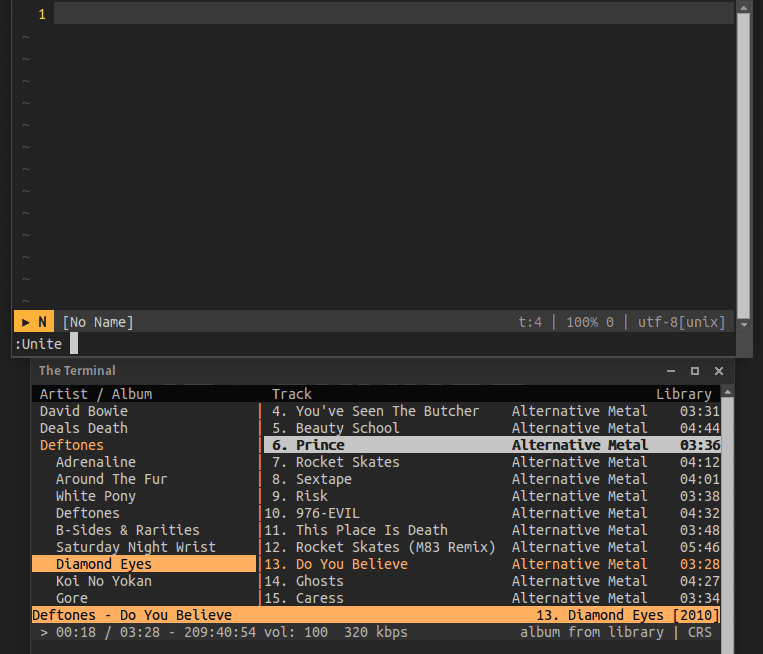

# Unite-cmus


Description
-----------

[Cmus](https://cmus.github.io/) source for [unite](https://github.com/shougo/unite.vim) to play & queue tracks :musical_note:



Installation
-----------

You should of course have [unite](https://github.com/Shougo/unite.vim) installed.

Use your preferred method to install the plugin(s), I recommend you to use a plugin manager.  
e.g with [Vim-plug](https://github.com/junegunn/vim-plug) using group dependencies feature.

```vim
Plug 'KabbAmine/unite-cmus' | Plug 'Shougo/unite.vim'
```

Usage
-----

```vim
:Unite cmus
```

| action          | description                                         |
| -------------   | ------------------------                            |
| `play`          | Play the selected track (Action by default)          |
| `queue`         | Add the selected track(s) to the queue playlist     |
| `prepend2queue` | Prepend the selected track(s) to the queue playlist |

Bonus
-----

You may not need it, but if you want to have a global command to control cmus from vim, add this portion of code to your `vimrc` (Adapt `s:cmusCmds` to your needs):

```vim
if executable('cmus')
	let s:cmusCmds = {
				\ '-play'      : 'p',
				\ '-pause'     : 'u',
				\ '-stop'      : 's',
				\ '-next'      : 'n',
				\ '-previous'  : 'r',
				\ '-repeat'    : 'R',
				\ '-shuffle'   : 'S',
			\ }

	command! -nargs=? -bar -complete=custom,CompleteCmus Cmus :call <SID>Cmus('<args>')

	function! <SID>Cmus(...) abort
		let l:arg = exists('a:1') && !empty(get(s:cmusCmds, a:1)) ?
					\ get(s:cmusCmds, a:1) : 'u'
		silent call system('cmus-remote -' . l:arg)
	endfunction

	function! CompleteCmus(A, L, P) abort
		return join(keys(s:cmusCmds), "\n")
	endfunction
endif
```

Then you'll have access to the command `:Cmus` (Use `-pause` when no argument is provided).


## Notes

Thanks to Bram Moolenaar for creating the best piece of software in the world :heart:  
Thanks to @Shougo for the wonderful unite.  
Thanks to you if you're using unite-cmus.

## License

MIT
